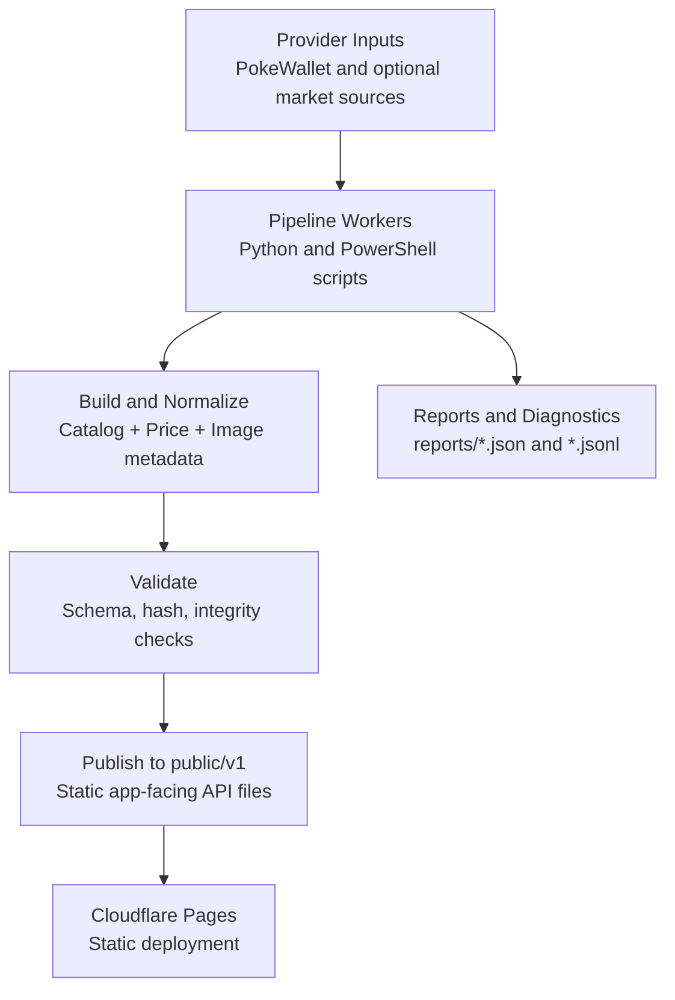

# CardScanR Data Engine

CardScanR Data Engine is the data backbone for the CardScanR app.

It builds, validates, and publishes app-ready card catalog and pricing datasets, plus optional market-pricing evidence from eBay browser workflows. It is designed to run safely in local-first and CI-assisted modes with strict release guardrails.

## What This Program Does

At a high level, this repository:

- Collects and refreshes Pokemon catalog metadata (primarily via PokeWallet workflows).
- Builds app-facing static datasets under `public/v1`.
- Generates current-price datasets for supported game/language/market combinations.
- Optionally runs market-pricing worker/scheduler jobs against Supabase-backed queues.
- Produces diagnostics and runtime reports for traceability.
- Validates outputs and publishes safe, controlled releases.

If you need one sentence: this project turns upstream card/provider data into a versioned, app-consumable static API.

## Core Outputs

Main app contract outputs are under `public/v1`:

- `public/v1/index.json` (manifest and hashes)
- `public/v1/app-config.json`
- `public/v1/supported-games.json`
- `public/v1/supported-sources.json`
- `public/v1/supported-languages.json`
- `public/v1/supported-markets.json`
- `public/v1/catalog/...` (set/card catalogs)
- `public/v1/prices/current/...` (current prices)
- `public/v1/images/cache-policy.json`

Contract details are documented in `docs/APP_DATA_CONTRACT.md`.

## Data Flow



## Repository Map

- `cardscanr_market_engine/`: market pricing engine logic (job runner, scheduler, filters, providers).
- `workers/`: worker/scheduler entrypoints.
- `scripts/`: operational PowerShell helpers (run loops, smoke tests, release, status/watch scripts).
- `tools/`: pipeline/build/validation utilities.
- `data/`: tracked configuration and persisted state files.
- `public/v1/`: app-facing static datasets.
- `reports/`: latest run diagnostics and historical jsonl logs.
- `docs/`: detailed workflow and contract documentation.

## Quick Start

## 1) Prerequisites

- Windows (PowerShell examples are provided; Python scripts are cross-platform).
- Python 3.10+.
- Optional: Google Chrome installed (for eBay browser provider workflows).
- Optional: Supabase project credentials for worker/scheduler writes.

## 2) Install dependencies

```powershell
python -m venv .venv
.\.venv\Scripts\Activate.ps1
pip install -r requirements.txt
```

Current Python dependencies:

- `requests`
- `playwright`

## 3) Configure Supabase (when using market engine writes)

Copy and fill local config:

- `supabase_env.example.json` -> `supabase_env.local.json`

Then load into session:

```powershell
. scripts/load_supabase_env.ps1 supabase_env.local.json
```

Notes:

- Use `SUPABASE_SERVICE_ROLE_KEY` only for worker/scheduler write paths.
- Keep `supabase_env.local.json` local and uncommitted.

## Main Ways To Run

## A) Full data pipeline (catalog + derived app data)

```powershell
.\scripts\run_cardscanr_full_data_pipeline.ps1
```

Common variants:

```powershell
.\scripts\run_cardscanr_full_data_pipeline.ps1 -NoFetch
.\scripts\run_cardscanr_full_data_pipeline.ps1 -UntilComplete -MaxRequestsPerHour 90 -MaxRequestsPerDay 900
.\scripts\run_cardscanr_full_data_pipeline.ps1 -BuildAppCatalogue -DownloadImages -Validate
```

See: `docs/FULL_DATA_PIPELINE.md`.

## B) Local EN rotating price updater

```powershell
.\scripts\run_local_price_update.ps1 -BatchSize 20
```

Long-run variants:

```powershell
.\scripts\run_local_price_update.ps1 -BatchSize 20 -AllDay
.\scripts\run_local_price_update.ps1 -BatchSize 20 -UntilComplete
```

See: `docs/LOCAL_PRICE_UPDATER.md`.

## C) Market price engine (Supabase queue based)

Live eBay worker for app scan/refresh price jobs:

```powershell
.\scripts\run_ebay_price_worker.ps1
```

This is the normal script to keep running when the app should process queued eBay price updates. It uses the guarded live eBay setup, a dedicated local Chrome profile, and one job at a time by default.

Worker (lower-level queue processor):

```powershell
.\scripts\run_market_price_worker.ps1 -Once
```

Scheduler (enqueues stale/missing work):

```powershell
.\scripts\run_market_price_scheduler.ps1 -Once
```

Local combined loop (scheduler + worker orchestration):

```powershell
.\scripts\run_market_price_engine_local.ps1 -Cycles 1 -DryRun
```

## D) Smoke tests

Mock-safe engine smoke:

```powershell
.\scripts\run_market_price_engine_smoke.ps1
```

Guarded live eBay write smoke (requires explicit confirmation env var):

```powershell
.\scripts\run_ebay_browser_live_write_smoke.ps1
```

Guarded live eBay scheduler smoke:

```powershell
.\scripts\run_ebay_browser_live_scheduler_smoke.ps1 -DryRun
```

## Configuration and Safety Guardrails

This repo is intentionally defensive. Important behavior includes:

- Environment-first secret loading; local fallback file for development.
- Strict separation of anon key vs service role key usage.
- Mock-only defaults for local market engine paths unless explicitly enabled.
- Explicit confirmation flags for live eBay write workflows.
- Budget-aware request pacing for PokeWallet-related workflows.
- Controlled release script that only stages approved outputs.

Key scripts and docs:

- `scripts/release_cardscanr_data.ps1`
- `docs/POKEWALLET_CATALOG_WORKER.md`
- `docs/POKEWALLET_API_CAPABILITY_INTEGRATION.md`

## Reports and Diagnostics

Most runs write status to `reports/` and selected runtime files under `data/` and `logs/`.

Common report files:

- `reports/market_price_worker_latest.json`
- `reports/market_price_scheduler_latest.json`
- `reports/market_price_engine_local_latest.json`
- `reports/ebay_browser_live_worker_batch_latest.json`
- `reports/ebay_browser_live_scheduler_latest.json`

For eBay browser debugging, check:

- `reports/ebay_browser_debug/latest/debug_summary.json`

That summary explains:

- query attempts and stop reason
- included vs rejected comparables
- confidence and reliability flags
- parser/selector anomalies
- stale evidence conditions

## Validation and Release

Run validation:

```powershell
python tools/validate_cache.py
```

Safe release workflow:

```powershell
.\scripts\release_cardscanr_data.ps1
```

Dry run release:

```powershell
.\scripts\release_cardscanr_data.ps1 -DryRun
```

Optional push:

```powershell
.\scripts\release_cardscanr_data.ps1 -Push
```

## Deployment

This repository is deployed as static content via Cloudflare Pages.

- Build output directory: `public`
- No runtime build step required for deployment of committed static artifacts
- `public/_headers` controls CORS/cache behavior

## FAQ

### Is this only a static data repo?

It publishes static app data, but it also contains active worker/scheduler logic, budget-aware fetch loops, smoke tests, and release automation.

### Does it run eBay scraping by default?

No. Live eBay paths are guarded and require explicit enablement and confirmation flags.

### Are prices converted between currencies?

Not automatically in the core staged importer path. Source currencies are preserved unless a validated conversion policy is explicitly applied.

## Related Docs

- `docs/APP_DATA_CONTRACT.md`
- `docs/FULL_DATA_PIPELINE.md`
- `docs/LOCAL_PRICE_UPDATER.md`
- `docs/POKEWALLET_CATALOG_WORKER.md`
- `docs/POKEWALLET_MISSING_PRICE_WORKER.md`
- `docs/POKEWALLET_API_CAPABILITY_INTEGRATION.md`

## License and Usage

No license file is declared in this repository at the time of writing. If this is intended to be open-source, add a `LICENSE` file and update this section accordingly.
